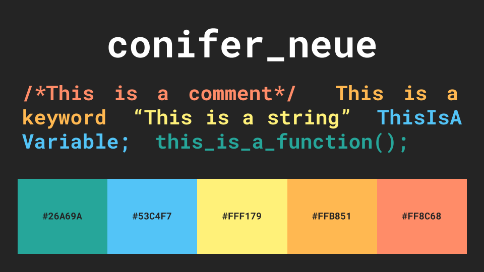

# Conifer Neue for Atom
Yet Another Organic Color Palette.

INSTALL

1. Open Atom and navigate to Edit -> Preferences -> Install (sidebar)

2. Click on the Themes button next to the search bar.
  
3. Search for coniferneue-dark-syntax.
  
4. Click on the Install button.
  
UNINSTALL

1. Open Atom and navigate to Edit -> Preferences -> Themes

2. Use the "Syntax Theme" dropdown menu to select a different Atom Syntax theme.

3. Look for "coniferneue-dark-syntax" under the "Installed Themes" section.

4. Click the "Uninstall" button.
  
CONTACT
  
 - Julio Cabria - julicabria@outlook.com
 - GitHub - https://github.com/Julynx/coniferneue-dark-syntax
