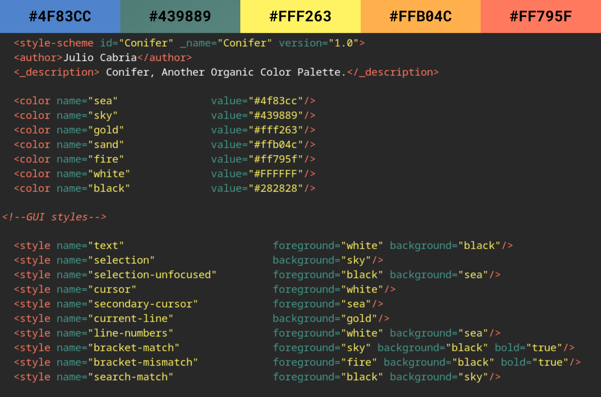

# conifer_atom
Another Organic Color Palette.

INSTALL

1. Download using the GitHub .zip download option and unzip.

2. Move the "conifer-dark-syntax" folder to "~/.atom/packages". If you dont see the ".atom" folder, try using CTRL + H to show hidden folders in most linux distros. If there is no "packages" folder inside the ".atom" folder, create a folder and name it "packages".
  
3. Open Atom and navigate to Edit -> Preferences -> Themes. Make sure "conifer-dark-syntax" appears under the "Installed Themes" section. (Restart Atom if needed.)
  
4. Use the "Syntax Theme" dropdown menu to select "Conifer Dark" as your Atom Syntax theme. You may use another "UI Theme" in combination with Conifer syntax theme.
  
UNINSTALL

1. Open Atom and navigate to Edit -> Preferences -> Themes

2. Use the "Syntax Theme" dropdown menu to select a different Atom Syntax theme.

3. Look for "conifer-dark-syntax" under the "Installed Themes" section.

4. Click the "Uninstall" button.
  
CONTACT
  
 - Julio Cabria - julicabria@outlook.com
 - GitHub - https://github.com/Julynx/conifer_atom
